  
[{fig-align="center"}](https://500px.com/p/antoinemach?view=photos)  
  
::: {.callout-note icon="false"}
[**Twitch du 16 décembre 2025**](https://www.twitch.tv/videos/2645347872).\

PDF disponible sur [GitHub](https://github.com/Vaugoyeau/twitch_shiny_bslib/blob/master/twitch_shiny_bslib.pdf).  
:::
  
# S'initier à la création d'applications web

## C'est quoi une appli web ?

-   Une applications web est un objet informatique **manipulable directement, en ligne et sans installation**\
-   Une application peut aussi être présente sur le réseau interne d'une entreprise, sur un unique ordinateur ou hébergée en ligne.

## Construire une application

-   Avoir une idée\
-   Documenter les besoins et attentes des utilisateur.trice.s\
-   Relier les besoins et attentes à des actions\
-   Lister les données nécessaires puis faire **valider**\
-   Réaliser une maquette simple et la **valider**\
-   Construire une maquette fidèle et la **valider**\
-   Coder l'application\
-   Faire tourner en local\
-   Déployer l'application\
-   Faire évoluer ou abandonner

## Shiny

[`{shiny}`](https://shiny.posit.co/) est un package `R` développé par [{width="10%"}](https://posit.co/) en 2012.

{width="20%"}

## Explorer `Shiny`

-   Avant `Shiny`, il était nécessaire d'avoir une bonne connaissance des technologies du web (`HTML`, `CSS`,...)\
-   `Shiny` permet de :
    -   générer simplement le front-end (l'interface utilisateur.trice) et le back-end sans apprendre de langage web\
    -   faire des tableaux de bords mais aussi des pages web pour communiquer les résultats\
    -   de travailler directement sur les données de la personne utilisatrice\
    -   de gérer des cartes, des tableaux, des graphiques, des questionnaires...

## Exemples de réalisation

Beaucoup d'exemples sont disponibles dans la [galerie de Shiny](https://shiny.posit.co/r/gallery/)\
  

## Comprendre la structure d'une application

Toutes les applications ont :

-   une partie `User Interface` qui permet de gérer le `Front-End`, c'est-à-dire à quoi l'**application ressemble**\
-   une partie `Server` qui gère le `Back-End`, c'est-à-dire les mécanismes sous-jacents ou **que fait l'application**

::: callout-note
## A retenir

Dans une application `Shiny`, l'interface utilisateur.trice est géré par la fonction ou le fichier `ui` et les coulisses par la fonction ou le fichier `Server`.
:::

## Création d'une structure de page avec `{bslib}`

Avec le package [`{bslib}`](https://rstudio.github.io/bslib/index.html), une page est construite à partir d'une ou plusieurs sections appelées `card`

Les `card` peuvent-être :

-   avec ou sans barre latérale 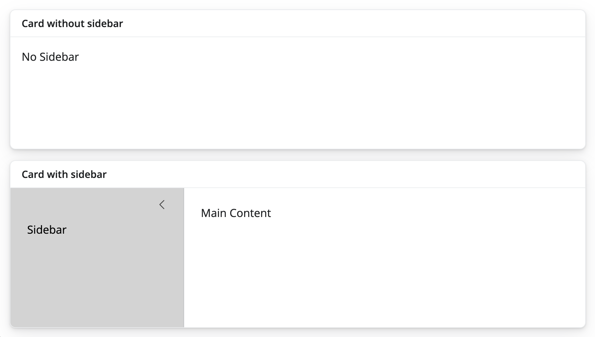\

```{r}
library(bslib)

ui <- page_fillable(

  card(
    card_header("Card without sidebar"),
    "No Sidebar"
  ),
  
  card(
    card_header("Card with sidebar"),
    layout_sidebar(
      sidebar = sidebar(
        bg = "lightgrey",
        "Sidebar"
      ),
      "Main Content"
    )
  )
  
)
```

-   s'enchaîner sur la longueur de la page 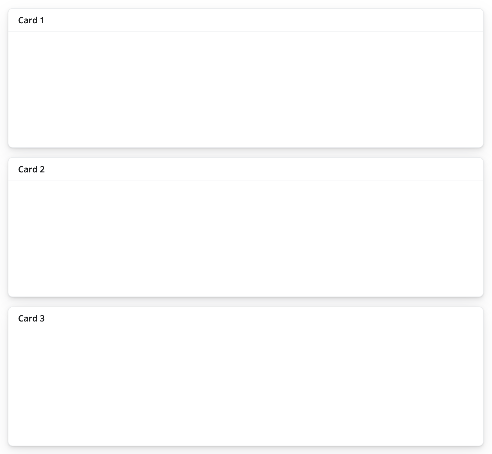\

```{r}
library(bslib)

ui <- page_fillable(

  card(card_header("Card 1")),
  card(card_header("Card 2")),
  card(card_header("Card 3"))
  
)
```

-   s'enchainer sur la largeur de la page 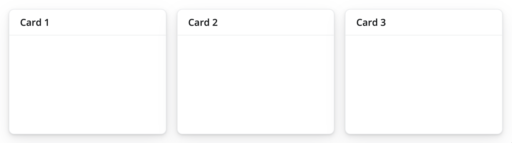\

```{r}
library(bslib)

ui <- page_fillable(

  layout_columns(
     card(card_header("Card 1")),
     card(card_header("Card 2")),
     card(card_header("Card 3"))
  )
  
)
```

::: callout-tip
## Modifier la largeur et hauteur des `cards`

L'argument `col_widths` permet de paramétrer la largeur de chaque `card`.\
Si la somme d'une seule ligne est supérieure à 12, une nouvelle ligne est crée par défaut.\
L’argument `row_heights` permet de fixer le rapport entre les lignes (une valeur fixe peut éventuellement être utilisée).
:::

::::: columns
::: column
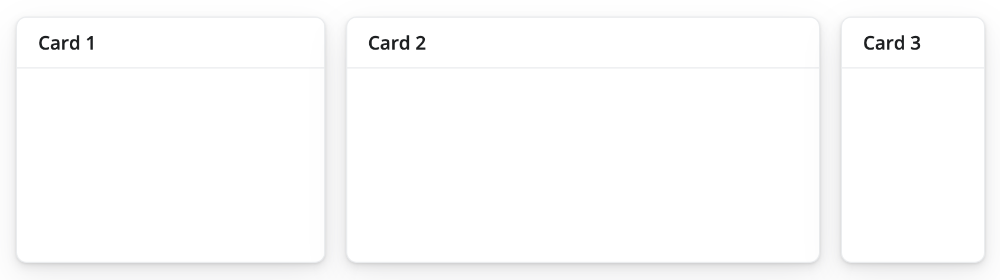

```{r}
library(bslib)

ui <- page_fillable(

  layout_columns(
    card(card_header("Card 1")),
    card(card_header("Card 2")),
    card(card_header("Card 3")),
    col_widths = c(4, 6, 2)
  )

)
```
:::

::: column
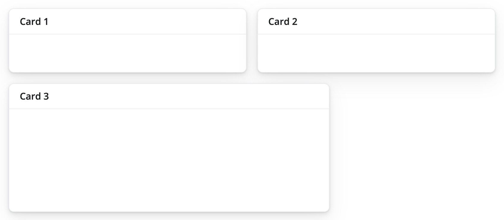

```{r}
library(bslib)

ui <- page_fillable(

  layout_columns(
    card(card_header("Card 1")),
    card(card_header("Card 2")),
    card(card_header("Card 3")),
    col_widths = c(6, 6, 8),
    row_heights = c(1, 2)
  )

)
```
:::
:::::

Il est aussi possible de mixer les `card` en lignes et colonnes\
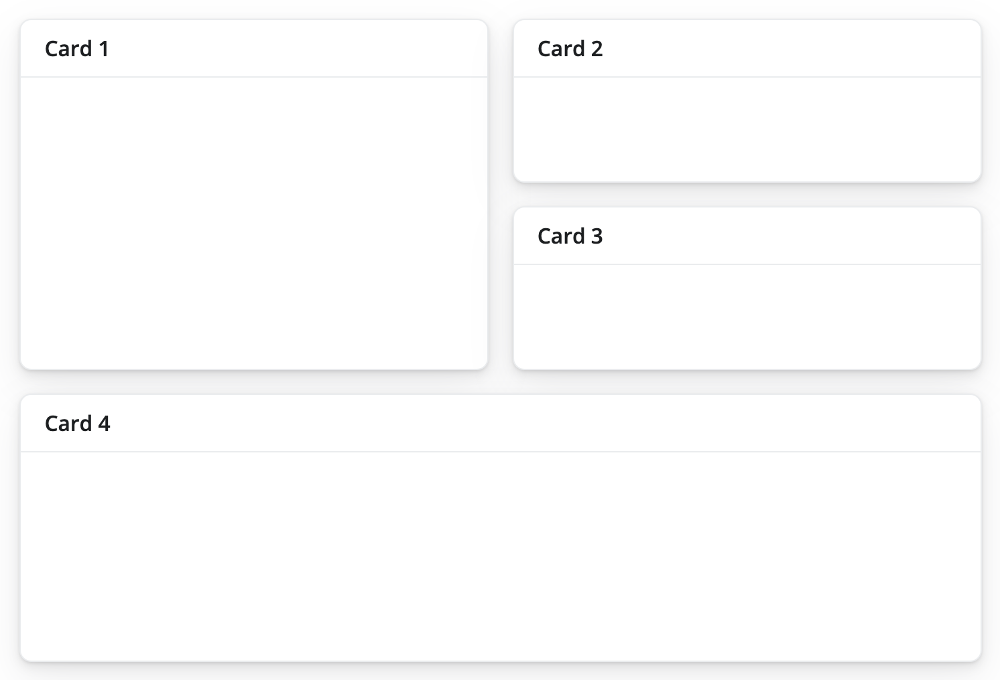

```{r}
library(bslib)  

ui <- page_fillable(

  layout_columns(
     card(card_header("Card 1")),
     layout_columns(
       card(card_header("Card 2")),
       card(card_header("Card 3")),
       col_widths = c(12, 12)
     )
  ),
     card(card_header("Card 4"))

)
```

::: callout-tip
## Pour aller plus loin

[Application layout guide](https://shiny.posit.co/r/articles/build/layout-guide/) sur le site de Shiny.
:::

# Application développée lors du live

## Une appli sur les pingouins

Lors du live, j'ai développée [cette application](https://mvaugoyeau.shinyapps.io/appli_penguins/), voici les différentes étapes 😊

## Initier la structure

Pour créer une appli Shiny, un seul fichier `.R` suffit.

::: callout-tip
## squelette d'une appli

Pour générer facilement le squelette d'une appli, taper `shinyapp` puis taper sur `Entrée` pour utiliser le `snippet`.
:::

Afin de créer l'application, je vais appeler le package `{bslib}` et `{tidyverse}` en plus du package `{shiny}`.

## Créer la structure

La structure choisie est un page avec une barre de navigation contenant le titre et deux onglets. Le premier onglet a dans la fenêtre une ligne avec deux colonnes et une deuxième ligne sur la totalité.\
Le deuxième onglet contient du texte.

```{r}
library(shiny)
library(bslib)
library(tidyverse)

ui <- page_navbar(
  title = "Les penguins",
  nav_panel(
    "Représentations",
    layout_columns(
      card(
        full_screen = TRUE,
        p("graphique sur la forme du bec")
      ),
      card(
        full_screen = TRUE,
        p("graphique sur la condition coporelle")
      )
    ),
    card(
      full_screen = TRUE,
      card_header("Données"),
      p("tableau des données")
    )
  ),
  nav_panel(
    "Information",
    p("Cette appli a été créée dans le cadre de la formation R-Shiny"),
    p("Pour plus d'information contacter Marie (marie.vaugoyea@gmail.com)")
  )
)

server <- function(input, output, session) {
  
}

shinyApp(ui, server)
```

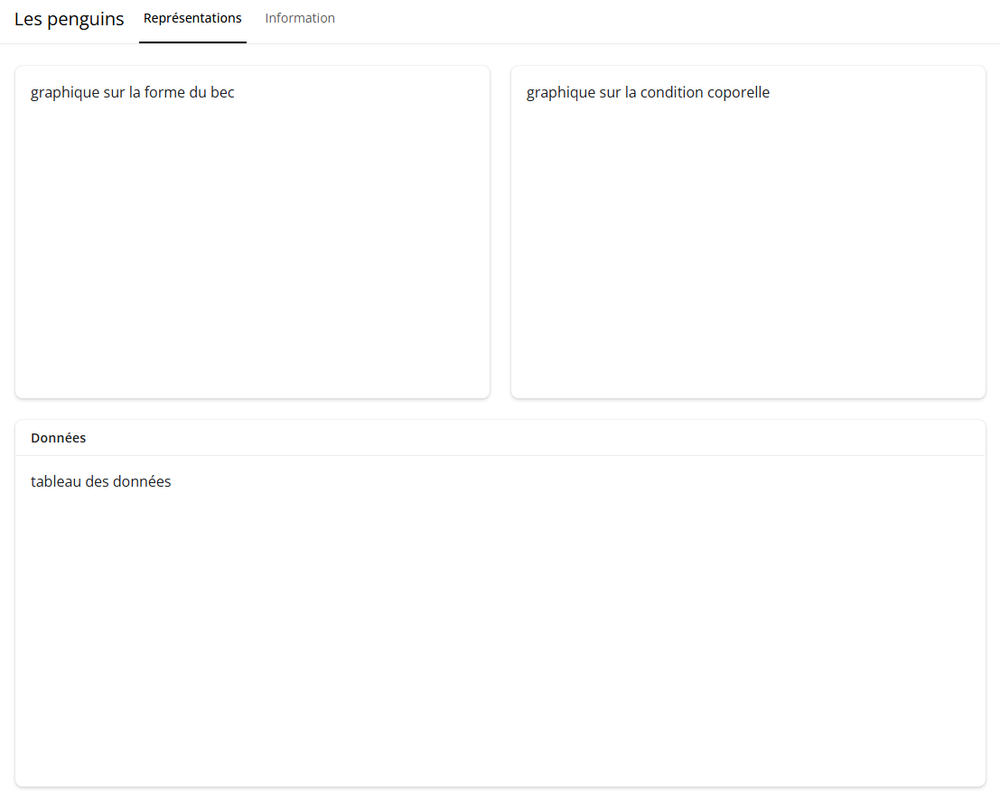

## Personnaliser l'interface

En ajoutant un thème grâce à la fonction `bs_theme()` du package `{bslib}` : `theme = bs_theme(bootswatch = "morph")`.\
La ligne doit être ajoutée dans la fonction `page_navbar()`. Je mets généralement **en premier** mais ce n'est pas obligatoire.

En ajoutant des barres latérales afin de donner la possibilité de choisir une espèce pour le tableau et une île pour le graphique sur la condition corporelle.\
Le fond des barres latérales a été modifiés grâce à l'argument `bg`.

```{r}
library(shiny)
library(bslib)
library(tidyverse)

ui <- page_navbar(
  theme = bs_theme(bootswatch = "morph"),
  title = "Les penguins",
  nav_panel(
    "Représentations",
    layout_columns(
      card(
        full_screen = TRUE,
        p("graphique sur la forme du bec")
      ),
      card(
        full_screen = TRUE,
        layout_sidebar(
          sidebar = sidebar(
            bg = "lightblue"
          ),
          p("graphique sur la condition coporelle")
        )
      )
    ),
    card(
      full_screen = TRUE,
      card_header("Données"),
      layout_sidebar(
        sidebar = sidebar(
          bg = "darkblue"
        ),
        p("tableau des données")
      )
    )
  ),
  nav_panel(
    "Information",
    p("Cette appli a été créée dans le cadre de la formation R-Shiny"),
    p("Pour plus d'information contacter Marie (marie.vaugoyea@gmail.com)")
  )
)

server <- function(input, output, session) {
  
}

shinyApp(ui, server)
```

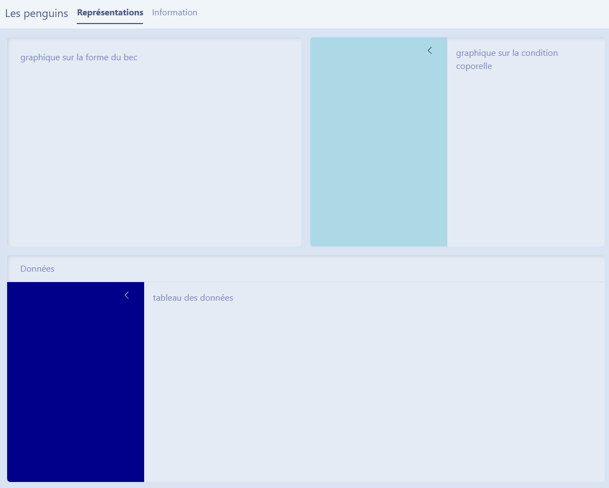

## Ajouter un élément intéractif

Le premier graphique ajouté est celui de la forme du bec. Il est rendu intéractif par l'utilisation du package [`{plotly}`](https://plotly.com/r/).

::: callout-important
## interactif = server au repos

L’interactivité repose sur l’idée que l’utilisateur peut influencer le comportement de l’application sans relancer le code.
:::

```{r}
library(shiny)
library(bslib)
library(tidyverse)
library(plotly)

# creation vecteur_couleur
vecteur_quali <- 
  c(
    "Adelie" = "#DF9ED4FF",
    "Chinstrap" = "#C93F55FF",
    "Gentoo" = "#EACC62FF",
    "Biscoe" = "#469D76FF",
    "Dream" = "#3C4B99FF",
    "Torgersen" = "#924099FF"
  )

ui <- page_navbar(
  theme = bs_theme(bootswatch = "morph"),
  title = "Les penguins",
  nav_panel(
    "Représentations",
    layout_columns(
      card(
        full_screen = TRUE,
        plotlyOutput("bec")
      ),
      card(
        full_screen = TRUE,
        layout_sidebar(
          sidebar = sidebar(
            bg = "lightblue"
          ),
          p("graphique sur la condition coporelle")
        )
      )
    ),
    card(
      full_screen = TRUE,
      card_header("Données"),
      layout_sidebar(
        sidebar = sidebar(
          bg = "darkblue"
        ),
        p("tableau des données")
      )
    )
  ),
  nav_panel(
    "Information",
    p("Cette appli a été créée dans le cadre de la formation R-Shiny"),
    p("Pour plus d'information contacter Marie (marie.vaugoyea@gmail.com)")
  )
)

server <- function(input, output, session) {
  output$bec <- renderPlotly(
    penguins |> 
      drop_na() |> 
      ggplot() +
      aes(
        x = bill_dep,
        y = bill_len,
        shape = sex,
        color = species,
        linetype = sex
      ) +
      geom_point() +
      geom_smooth(method = "lm", se = FALSE) + 
      scale_color_manual(values = vecteur_quali) +
      scale_shape_manual(values = c(17,6)) +
      labs(
        title = "Forme du bec",
        x = "largeur du bec (mm)",
        y = "longueur du bec (mm)",
        color = "espèce",
        shape = "sexe",
        linetype = "sexe"
      ) +
      theme_minimal()
  )
}

shinyApp(ui, server)
```

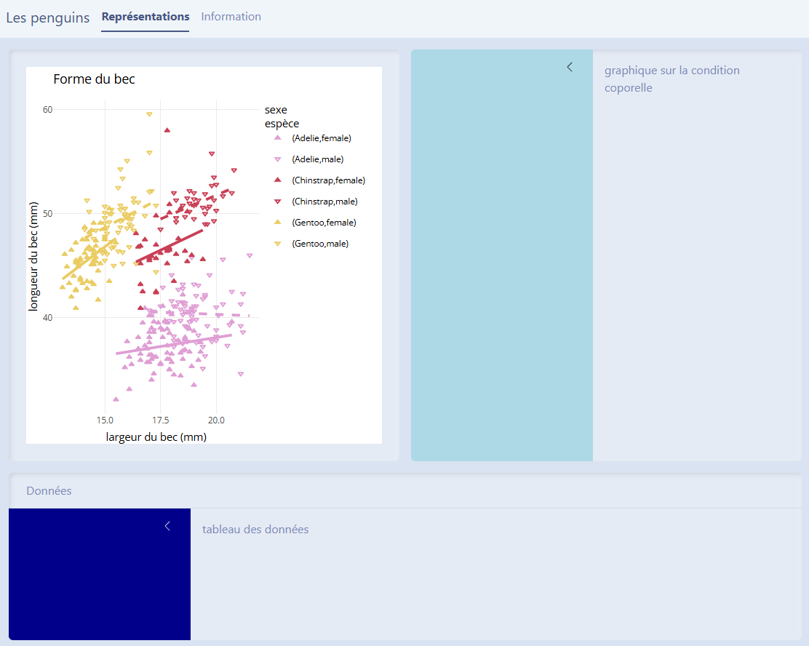

Tu peux voir ici qu'un objet `bec` a été créé dans la partie `Server` grâce à `renderPlotly()` du package `{plotly}` et appelé dans la partie `ui` grâce à la fonction `plotlyOutput()` du même package.

## Paramétrer les choix de l'utilisateurice

Pour le graphique, la personne pourra choisir l'île ou les îles à représenter et dans le tableau, le choix de(s) espèce(s).\
Dans ce cas, il faut ajouter deux [widgets](https://shiny.posit.co/r/gallery/widgets/widget-gallery/) qui va permettre de rendre réactif l'appli shiny.

::: callout-important
## réactivité = code tourne

La réactivité repose sur l’idée que l’application réagit dynamiquement et sans délai aux actions de l’utilisateur.trice.
:::

Chaque choix est enregistré dans un `input` qui a un nom unique puis utilisé dans la partie `server`.

```{r}
library(shiny)
library(bslib)
library(tidyverse)
library(plotly)
library(DT)

# creation vecteur_couleur
vecteur_quali <- 
  c(
    "Adelie" = "#DF9ED4FF",
    "Chinstrap" = "#C93F55FF",
    "Gentoo" = "#EACC62FF",
    "Biscoe" = "#469D76FF",
    "Dream" = "#3C4B99FF",
    "Torgersen" = "#924099FF"
  )

ui <- page_navbar(
  theme = bs_theme(bootswatch = "morph"),
  title = "Les penguins",
  nav_panel(
    "Représentations",
    layout_columns(
      card(
        full_screen = TRUE,
        plotlyOutput("bec")
      ),
      card(
        full_screen = TRUE,
        layout_sidebar(
          sidebar = sidebar(
            bg = "lightblue",
            checkboxGroupInput(
              "ile",
              "Choississez une île",
              selected = penguins$island |> fct_unique(),
              choiceNames = penguins$island |> fct_unique(),
              choiceValues = penguins$island |> fct_unique()
            )
          ),
          plotOutput("masse")
        )
      )
    ),
    card(
      full_screen = TRUE,
      card_header("Données"),
      layout_sidebar(
        sidebar = sidebar(
          bg = "darkblue",
          checkboxGroupInput(
            "espece",
            "Choississez une espèce",
            selected = penguins$species |> fct_unique(),
            choiceNames = penguins$species |> fct_unique(),
            choiceValues = penguins$species |> fct_unique()
          )
        ),
        DTOutput("table")
      )
    )
  ),
  nav_panel(
    "Information",
    p("Cette appli a été créée dans le cadre de la formation R-Shiny"),
    p("Pour plus d'information contacter Marie (marie.vaugoyea@gmail.com)")
  )
)

server <- function(input, output, session) {
  output$bec <- renderPlotly(
    penguins |> 
      drop_na() |> 
      ggplot() +
      aes(
        x = bill_dep,
        y = bill_len,
        shape = sex,
        color = species,
        linetype = sex
      ) +
      geom_point() +
      geom_smooth(method = "lm", se = FALSE) + 
      scale_color_manual(values = vecteur_quali) +
      scale_shape_manual(values = c(17,6)) +
      labs(
        title = "Forme du bec",
        x = "largeur du bec (mm)",
        y = "longueur du bec (mm)",
        color = "espèce",
        shape = "sexe",
        linetype = "sexe"
      ) +
      theme_minimal()
  )
  
  output$masse <- renderPlot({
    penguins |> 
      filter(island %in% input$ile) |> 
      drop_na() |> 
      ggplot() +
      aes(
        x = body_mass,
        y = flipper_len,
        color = island
      ) +
      geom_point() +
      geom_smooth(method = "lm", se = FALSE) + 
      scale_color_manual(values = vecteur_quali) +
      labs(
        title = "Condition corporelle",
        x = "masse (g)",
        y = "longueur de la nageaoire (mm)",
        color = "île"
      ) +
      facet_wrap(~ species) +
      theme_minimal()
  })
  
  data <- reactive({
    penguins |> filter(species %in% input$espece)
  })
  
  output$table <- renderDT(
    data(),
    class = "cell-border compact",
    extensions = c("Buttons"),
    filter = "top",
    options = 
      list(
        pageLength = 5, 
        dom = "Blftip",
        buttons = c(
          "copy", "csv", "excel", "pdf", "print"
        )
      ),
    editable = "cell",
    rownames = FALSE
  ) 
}

shinyApp(ui, server)
```

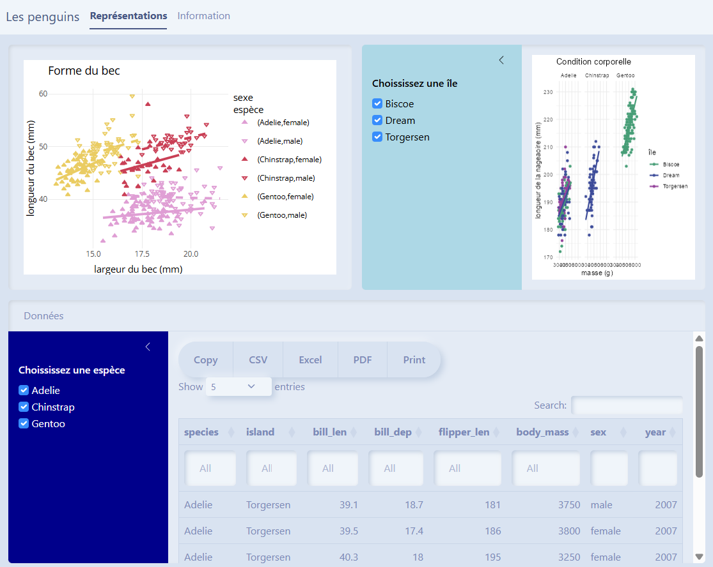

Comme précédemment, les objets créés dans la partie `server` grâce aux fonctions `render*()` du package `{shiny}` et `{DT}` sont appelés dans la partie `ui` grâce aux fonctions miroirs `*Output()` des mêmes packages.

::: callout-tip
## `reactive()` de `{shiny}`

La fonction `reactive()` permet de créer un objet qui va êtrer modifier à chaque modification de l'`input` associé.
:::

## Communiquer avec l'utilisateurice

Il est important de communiquer avec la(les) personne(s) utilisant l'appli à travers des messages pour la guider dans son utilisation.\
Par exemple, ici, le choix d'au moins une espèce ou d'une île est obligatoire.

Dans ce cas, on va bloquer la création des sorties au fait de faire un choix grâce à la fonction `req()` du package `{shiny}`.\
On va aussi envoyer un message en cas d'absence de choix grâce aux fonctions `textOutput()` et `renderText()` du package `{shiny}`.

```{r}
library(shiny)
library(bslib)
library(tidyverse)
library(plotly)
library(DT)

# creation vecteur_couleur
vecteur_quali <- 
  c(
    "Adelie" = "#DF9ED4FF",
    "Chinstrap" = "#C93F55FF",
    "Gentoo" = "#EACC62FF",
    "Biscoe" = "#469D76FF",
    "Dream" = "#3C4B99FF",
    "Torgersen" = "#924099FF"
  )

ui <- page_navbar(
  theme = bs_theme(bootswatch = "morph"),
  title = "Les penguins",
  nav_panel(
    "Représentations",
    layout_columns(
      card(
        full_screen = TRUE,
        plotlyOutput("bec")
      ),
      card(
        full_screen = TRUE,
        layout_sidebar(
          sidebar = sidebar(
            bg = "lightblue",
            checkboxGroupInput(
              "ile",
              "Choississez une île",
              selected = penguins$island |> fct_unique(),
              choiceNames = penguins$island |> fct_unique(),
              choiceValues = penguins$island |> fct_unique()
            )
          ),
          plotOutput("masse"),
          textOutput("message_ile")
        )
      )
    ),
    card(
      full_screen = TRUE,
      card_header("Données"),
      layout_sidebar(
        sidebar = sidebar(
          bg = "darkblue",
          checkboxGroupInput(
            "espece",
            "Choississez une espèce",
            selected = penguins$species |> fct_unique(),
            choiceNames = penguins$species |> fct_unique(),
            choiceValues = penguins$species |> fct_unique()
          )
        ),
        DTOutput("table"),
        textOutput("message_espece")
      )
    )
  ),
  nav_panel(
    "Information",
    p("Cette appli a été créée dans le cadre de la formation R-Shiny"),
    p("Pour plus d'information contacter Marie (marie.vaugoyea@gmail.com)")
  )
)

server <- function(input, output, session) {
  output$bec <- renderPlotly(
    penguins |> 
      drop_na() |> 
      ggplot() +
      aes(
        x = bill_dep,
        y = bill_len,
        shape = sex,
        color = species,
        linetype = sex
      ) +
      geom_point() +
      geom_smooth(method = "lm", se = FALSE) + 
      scale_color_manual(values = vecteur_quali) +
      scale_shape_manual(values = c(17,6)) +
      labs(
        title = "Forme du bec",
        x = "largeur du bec (mm)",
        y = "longueur du bec (mm)",
        color = "espèce",
        shape = "sexe",
        linetype = "sexe"
      ) +
      theme_minimal()
  )
  
  output$masse <- renderPlot({
    req(input$ile)
    penguins |> 
      filter(island %in% input$ile) |> 
      drop_na() |> 
      ggplot() +
      aes(
        x = body_mass,
        y = flipper_len,
        color = island
      ) +
      geom_point() +
      geom_smooth(method = "lm", se = FALSE) + 
      scale_color_manual(values = vecteur_quali) +
      labs(
        title = "Condition corporelle",
        x = "masse (g)",
        y = "longueur de la nageaoire (mm)",
        color = "île"
      ) +
      facet_wrap(~ species) +
      theme_minimal()
  })
  
  data <- reactive({
    req(input$espece)
    penguins |> filter(species %in% input$espece)
  })
  
  output$message_ile <- renderText(
    if (is.null(input$ile)){validate("Une île est nécessaire")}
  )
  
  output$message_espece <- renderText(
    if (is.null(input$espece)){validate("Une espèce est nécessaire")}
  )
  
  output$table <- renderDT(
    data(),
    class = "cell-border compact",
    extensions = c("Buttons"),
    filter = "top",
    options = 
      list(
        pageLength = 5, 
        dom = "Blftip",
        buttons = c(
          "copy", "csv", "excel", "pdf", "print"
        )
      ),
    editable = "cell",
    rownames = FALSE
  ) 
}

shinyApp(ui, server)
```

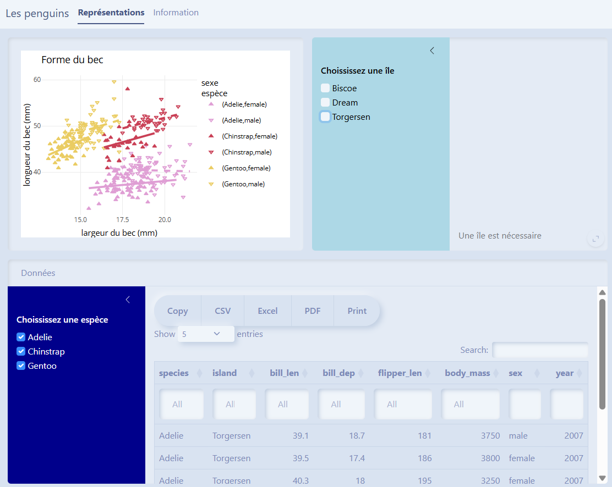

Et voilà, n'hésites pas à me faire des retours par [email](mailto:marie.vaugoyeau@gmail.com) ou sur [LinkedIn](https://www.linkedin.com/in/marie-vaugoyeau-72ab64153/) ✍️

::: callout-note
Tu peux aussi t'inscrire à la [newsletter](https://mvaugoyeau.kessel.media?source_type=social_network) pour être au courant du prochain live 📺
:::

Bonne journée 😊
