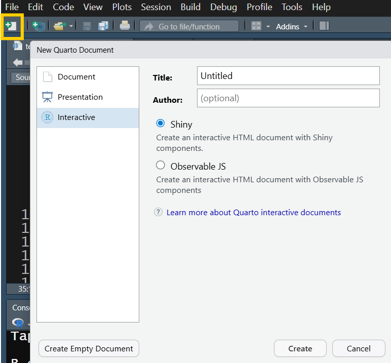
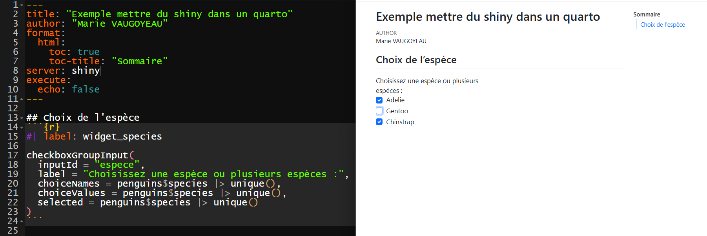
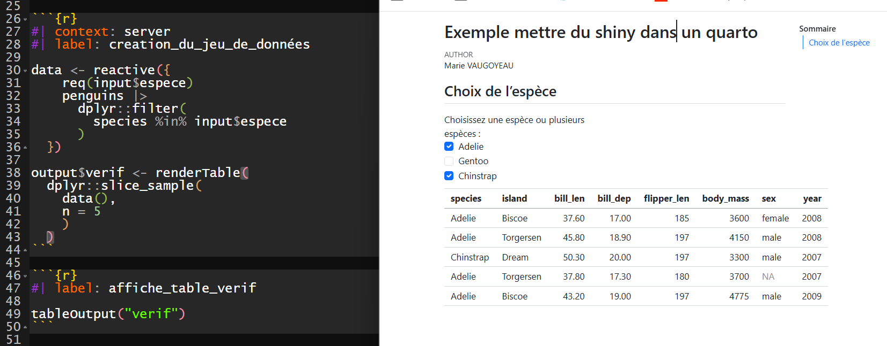
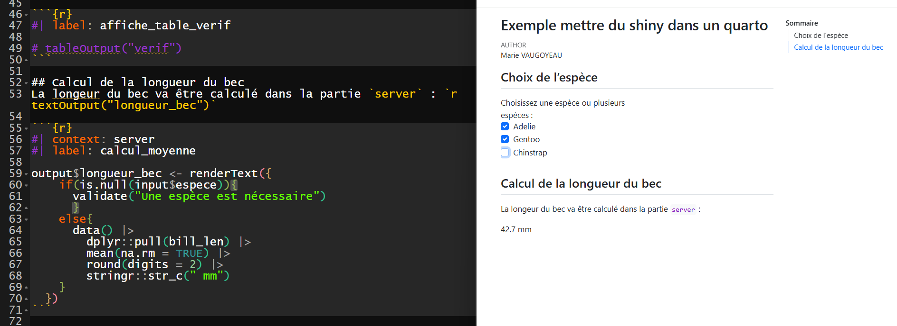
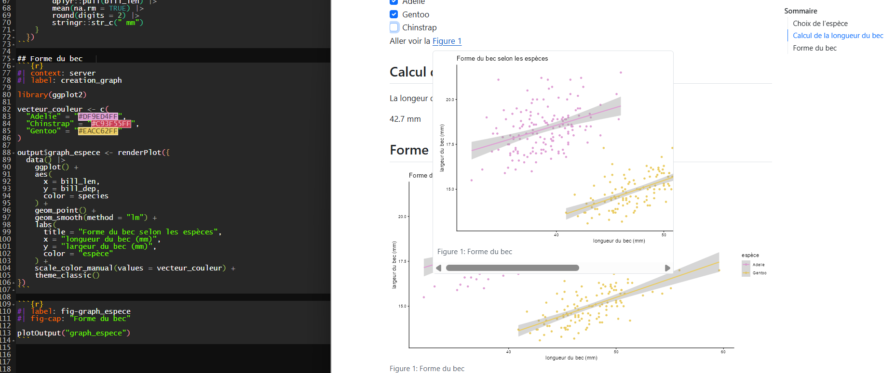
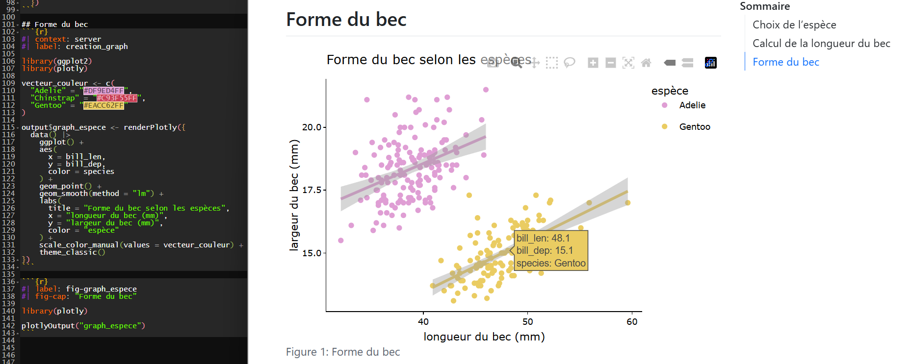
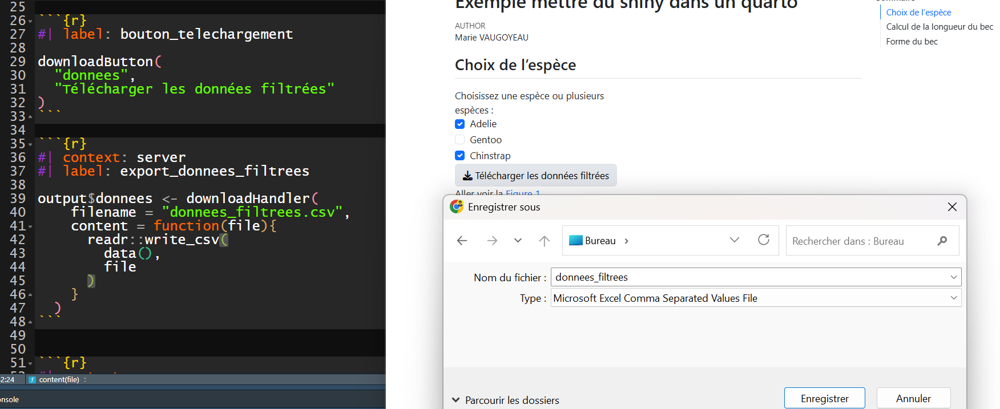

[{fig-align="center"}](https://500px.com/p/antoinemach?view=photos)

::: {.callout-note icon="false"}
[**Twitch du 29 janvier 2026**](https://www.twitch.tv/videos/2683405175).\

Pas de PDF pour cet article de blog sauf si tu trouves que c'est nécessaire.\
Dans ce cas, [écris le moi](mailto:marie.vaugoyeau@gmail.com) 💻
:::

# Avant de commencer

Si tu veux en savoir plus sur la création d'appli web avec le package shiny, je te conseille de regarder les deux articles sur shiny :

-   [Initiation à Shiny](https://mvaugoyeau.netlify.app/posts/shiny/)\
-   [Réaliser une appli avec `{shiny}` & `{bslib}`](https://mvaugoyeau.netlify.app/posts/shiny_bslib/)

En effet, il faut connaître un minimum le fonctionnement de `{shiny}` pour suivre ce qui suit 😊

# `{shiny}` & `quarto`

## Pourquoi mettre du `{shiny}` dans un `quarto` ?

Quarto est un outil très pratique pour produire un ensemble de supports à partir d'une même base, un (ou des) document(s) `.qmd`.\
**Mais** si on veut ajouter de la réactivité, c'est-à-dire que le code tourne pour produire des sorties, il faut nécessairement utiliser `{shiny}`.

::: callout-important
## réactivité = code tourne

La réactivité repose sur l’idée que l’application réagit dynamiquement et sans délai aux actions de l’utilisateur.trice en **relancant le code**.
:::

## Et du coup ça fonctionne comment ?

Le plus simple va être de créer un nouveau document quarto qui sera intéractif.\
Il faut donc commencer par créer le document en cliquant dans le menu `File` sur `New File`puis `Quarto Document...` ou en cliquant sur le logo carré blanc avec le plus blanc sur fond vert puis `Quarto Document...`.

Une fois sur la boîte de dialogue, on sélectionne `Interactive`.\


En cliquant sur `Create Empty Document`, tu créés un document vide.\
Si tu veux voir un exemple, clique directement sur `Create`.

::: callouot-tip
## Est-il possible de transformer un document quarto déjà réalisé ?

Oui, dans ce cas il faut ajouter `server: shiny` dans l'en-tête `YAML` et gérer les parties `server` et `ui` à la main.
:::

## Personnaliser le document

Pour personnaliser le document, c'est comme avec un quarto classique.

```{r}
#| echo: true

---
title: "Exemple mettre du shiny dans un quarto"
author: "Marie VAUGOYEAU"
format: 
  html:
    toc: true
    toc-title: "Sommaire"
server: shiny
execute:
  echo: false
---
```

Ici j'ai :

-   modifié le titre `Exemple mettre du shiny dans un quarto`\
-   ajouté mon nom comme autrice\
-   créé un sommaire (`toc: true` et `toc-title: "Sommaire"`)

Le paramètre `echo: false` permet de ne pas afficher le code dans la page générée.

::: callout-tip
## S'initier à Quarto

-   Avec mon article [Initiation à Quarto](https://mvaugoyeau.netlify.app/posts/quarto_initiation/)\
-   Sur le site de [`quarto`](https://quarto.org/docs/get-started/hello/rstudio.html)\
:::

# Réalisation pratique

## L'idée

Je souhaite que le choix d'une ou plusieurs espèces de pingouins mettent à jour un calcul et un graphique.

Il faut donc :

-   un widget contenant la liste des espèces à cocher -\> partie `ui` avec la fonction `checkboxGroupInput()` du package `{shiny}`\
-   les données qui se mettent à jour avec ou sans filtre -\> partie `server`\
-   le graphique et le calcul qui changent à chaque fois que les donnes changent -\> créés dans le `server` grâce aux fonctions `renderPlot()` et `renderText()` du package `{shiny}` et affichés dans la partie `ui` avec les fonctions `plotOutput()` et `textOutput()` du même package

::: callout-note
## widget

Ce sont des élèment web qui permettent à l’utilisateur.trice d’intéragir avec le server.\
L'information est passé de la partie `ui` à la partie `server` grâce à des `inputs` **uniques** et **obligatoires**
:::

## Utilisation du widget

Pour utiliser un *widget*, il est nécessaire de nommer l'`input`, ici `espece` grâce à l'argument `inputId`.\
L'argument `label` gère le texte afficher au niveau du widget.

```{r}
#| echo: fenced
#| label: widget_species

checkboxGroupInput(
  inputId = "espece",
  label = "Choisissez une espèce ou plusieurs espèces :",
  choiceNames = penguins$species |> unique(),
  choiceValues = penguins$species |> unique(),
  selected = penguins$species |> unique()
)
```



## Création de la table filtrée

Maintenant il faut ajouter la partie `server` pour faire le filtre sur les données.\
Et là, petite subtilité, il faut le préciser dans les paramétrages du chunck, grâce à `context: server`. Dans ce chunck, je créé aussi une table de vérification que va afficher que quelques lignes de `data()` pour vérifier que ça fonctionne grâce à la fonction `renderTable()` du package `{shiny}`.

```{r}
#| echo: fenced
#| context: server
#| label: creation_du_jeu_de_données

data <- reactive({
    req(input$espece) # ici le filtre ne s'applique pas s'il n'y a pas d'espèces choisie
    penguins |> 
      dplyr::filter(
        species %in% input$espece
      )
  })

output$verif <- renderTable(head(data()))
```

Pour afficher la table il faut dans la partie `ui`, utiliser la fonction `tableOutput()` du package `{shiny}`.

```{r}
#| label: affiche_table_verif
#| echo: fenced

tableOutput("verif")
```



## Calcul de la longeur moyenne du bec

Comme cela fonctionne, il est possible de réaliser le calcul de la longueur moyenne du bec grâce aux fonctions `renderText()` et `textOutput()` du package `{shiny}`.



::: callout-tip
## Desactiver du code

J'ai désactivé le code d'affichage de la table (pas celui de sa création) dans la partie `ui` grâce au signe dièse `#`
:::

La longeur du bec va être calculé dans la partie `server` : *r textOutput("longueur_bec")*

```{r}
#| echo: fenced
#| context: server
#| label: calcul_moyenne

output$longueur_bec <- renderText({
    if(is.null(input$espece)){validate("Une espèce est nécessaire")}
    else{
      data() |>
        dplyr::pull(bill_len) |>
        mean(na.rm = TRUE) |>
        round(digits = 2) |>
        stringr::str_c(" mm")
    }
  })
```

::: callout-note
## Ordre des lignes

Shiny s'affranchit de l'ordre des lignes, il est donc possible comme ici d'appeler un objet qui est créé ensuite dans le document.\
Bien sûr **cela ne fonctionnerait pas hors de shiny** !
:::

## Création graphique

Comme pour le calcul, le code va utiliser le jeu de données filtré pour réaliser le graphique.

::: callout-tip
## Appel aux packages

Ici j'utilise `{ggplot2}` pour créer le graphique, il faut donc faire l'appel dans la partie `ui` avec `library(ggplot2)`.
:::

```{r}
#| context: server
#| echo: fenced
#| label: creation_graph

library(ggplot2)

vecteur_couleur <- c(
  "Adelie" = "#DF9ED4FF",
  "Chinstrap" = "#C93F55FF",
  "Gentoo" = "#EACC62FF"
) 

output$graph_espece <- renderPlot({
  data() |> 
    ggplot() +
    aes(
      x = bill_len,
      y = bill_dep,
      color = species
    ) +
    geom_point() +
    geom_smooth(method = "lm") +
    labs(
      title = "Forme du bec selon les espèces",
      x = "longueur du bec (mm)",
      y = "largeur du bec (mm)",
      color = "espèce"
    ) +
    scale_color_manual(values = vecteur_couleur) +
    theme_classic()
})
```

```{r}
#| label: fig-graph_espece
#| echo: fenced
#| fig-cap: "Forme du bec"

plotOutput("graph_espece")
```



::: callout-tip
## Nommer une figure

En quarto, si le nom du chunk commence par `fig-`, le graphique généré sera considéré comme une figure, donc nommée Figure dans la sortie.\
Ainsi il est possible de faire un lien avec `@fig-nom_du_chunk` dans une autre partie du texte.
:::

Aller voir la @fig-graph_espece \`

## Rendre une figure intéractive

Lors de la vidéo, j'ai rendu le graphique intéractif grâce au package [`{plotly}`](https://plotly.com/r/).\
Pour ça, il suffit de remplacer les fonctions `renderPlot()` et `plotOutput()` de `{shiny}` par les fonctions `renderPlotly()` et `plotlyOutput()` du package `{plotly}`.

::: callout-warning
## Appel aux pacakges (bis)

Si le package est utilisé à la fois dans la partie `ui` et dans la partie `server`, il faut :

-   soit l'appeler dans les deux\
-   soit créer un script `global.R` comme j'ai fait dans la vidéo. **Attention**, le script `global.R` n'est **lu qu'une seule fois** au moment du lancement de l'appli shiny\
:::

```{r}
#| context: server
#| echo: fenced
#| label: creation_graph_interactif

library(ggplot2)
library(plotly)

vecteur_couleur <- c(
  "Adelie" = "#DF9ED4FF",
  "Chinstrap" = "#C93F55FF",
  "Gentoo" = "#EACC62FF"
) 

output$graph_espece <- renderPlotly({
  data() |> 
    ggplot() +
    aes(
      x = bill_len,
      y = bill_dep,
      color = species
    ) +
    geom_point() +
    geom_smooth(method = "lm") +
    labs(
      title = "Forme du bec selon les espèces",
      x = "longueur du bec (mm)",
      y = "largeur du bec (mm)",
      color = "espèce"
    ) +
    scale_color_manual(values = vecteur_couleur) +
    theme_classic()
})
```

```{r}
#| label: fig-graph_espece_interactif
#| echo: fenced
#| fig-cap: "Forme du bec"

library(plotly)

plotlyOutput("graph_espece")
```



## Télécharger des données

Pour garantir un libre accès aux données, il est facile de créer un bouton qui permet de télécharger le jeu de données filtré.

Dans la partie `ui`, on ajoute un bouton avec la fonction `downloadButton()` du package `{shiny}`.

Dans la partie `server`, il faut gérer avec la fonction `downloadHandler()` du même package qui prend en premier argument le *nom du fichier* (attention à l'extension) et en deuxième le *fichier*.

```{r}
#| label: bouton_telechargement
#| echo: fenced

downloadButton(
  "donnees",
  "Télécharger les données filtrées"
)
```

```{r}
#| context: server
#| echo: fenced
#| label: export_donnees_filtrees

output$donnees <- downloadHandler(
    filename = "donnees_filtrees.csv",
    content = function(file){
      readr::write_csv(
        data(),
        file
      )
    }
  )
```



## Gestion de l'alternance `server` / `ui`

Cela peut paraître compliquer de gérer l'alternance entre les parties `ui` et `server`.\
Saches qu'il est possible de s'affranchir de cette difficulté en utilisant un script `server.R` comme j'ai fait lors du live.

::: callout-tip
## Shiny et l'organisation du code

La partie `server` n'est pas impacté par l'ordre des lignes du code.\
Pour faciliter la lecture, tu peux mettre tous les chunks `server` au début ou à la fin du document.
:::

# Pour finir

Et voilà, n'hésites pas à me faire des retours par [email](mailto:marie.vaugoyeau@gmail.com) ou sur [LinkedIn](https://www.linkedin.com/in/marie-vaugoyeau-72ab64153/) ✍️

::: callout-note
Tu peux aussi t'inscrire à la [newsletter](https://mvaugoyeau.kessel.media?source_type=social_network) pour être au courant du prochain live 📺

<iframe src="https://mvaugoyeau.kessel.media/iframe?displayContext=false" width="480" height="130" frameborder="0" scrolling="no">

</iframe>
:::

Bonne journée 😊
