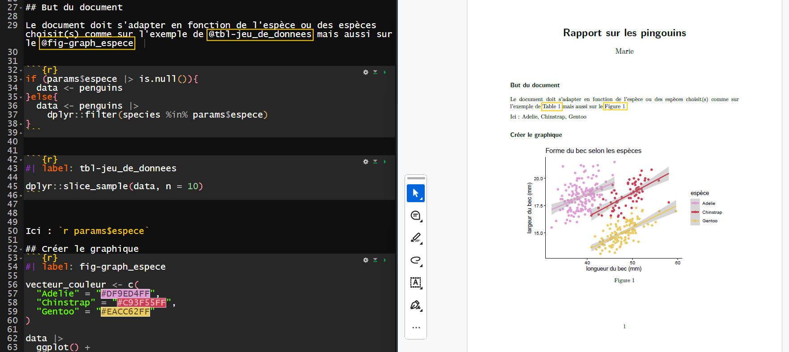
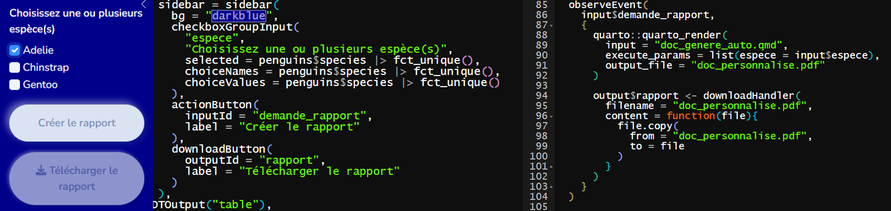
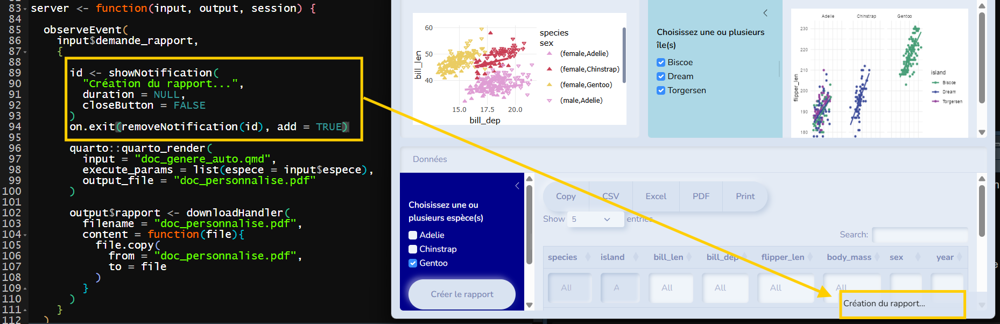

[{fig-align="center"}](https://500px.com/p/antoinemach?view=photos)

::: {.callout-note icon="false"}
[**Twitch du 19 mars 2026**](https://www.twitch.tv/videos/2726312227).\
:::

# Avant de commencer

Si tu veux en savoir plus sur la création d'appli web avec le package shiny, je te conseille de regarder les deux articles sur shiny :

-   [Initiation à Shiny](https://mvaugoyeau.netlify.app/posts/shiny/)\
-   [Réaliser une appli avec `{shiny}` & `{bslib}`](https://mvaugoyeau.netlify.app/posts/shiny_bslib/)

Ainsi que les articles sur `Quarto` si tu n'es pas à l'aise avec la syntaxe associée :  

- [Initiation à Quarto](https://mvaugoyeau.netlify.app/posts/quarto_initiation/)  
- [Intégrer {shiny} dans un document quarto](https://mvaugoyeau.netlify.app/posts/shiny_quarto/)  
  

# `{shiny}` & `quarto`

## `Quarto`, kesako ?  
[](https://quarto.org/)  
   
`Quarto`, ou plutôt le package `{quarto}` est un outil qui permet de créer facilement des documents reproductibles, répétables et réutilisables en combinant des portions de textes et des morceaux de code.  
  

## Et `{shiny}` ?  
[{width="10%"}](https://shiny.posit.co/)  
  
`Shiny` est un package `R` qui permet de construire facilement des application type web sans connaître les langages web.  
  
  
## Pourquoi générer un doc dans une appli ?  
Une personne utilise ton appli et veut en conserver une trace, elle peut :  

- récupérer les données et faire le même travail que toi. Une bonne perte de temps vu que tu l'as déjà fait...  
- prendre des captures d'écrans et les garder dans une fichier texte style `word` ou `mot`. Un peu dommage, quand même non ?  
- télécharger un rapport automatisé créé grâce à ton appli. Le top, non ?  
  
# Mise en pratique  
## Créer du rapport automatisé  
Ce rapport doit :  

- reprendre les points principaux de ton appli  
- montrer le résultat en fonction des choix de la personne utilisatrice  
  
Dans le live, j'ai décidé de repartir de l'[appli développée en décembre](https://mvaugoyeau.netlify.app/posts/shiny_bslib/).  
La rapport est construit en fonction de(s) l'espèce(s) choisit [dans le cadre bleu foncé](https://mvaugoyeau.shinyapps.io/appli_penguins/).  
  
Je veux que le rapport intègre un extrait aléatoire des lignes du tableau filtré ainsi qu'un graphique sur la forme du bec (le même que sur l'appli).  
  
Pour modifier le rapport en fonction des choix j'ai utilisé l'option [`params`](https://quarto.org/docs/dashboards/parameters.html).  
Les paramètres sont définis dans l'en-tête YAML avec une valeur par défaut.  
  
::: callout-note
## Peut-on tous mettre en paramètre ?
  
Le paramètre est nécessairement du texte ou un nombre.  
Il n'est pas possible de passer un jeu de données entier mais il est possible d'utiliser son nom ou son adresse.  
:::  
  
```{r}
---
title: "Rapport sur les pingouins"
author: "Marie" 
format: pdf
editor: visual
params:
  espece: NULL
execute: 
  echo: false
  warning: false
---

```

Il faut ensuite traiter le cas de ne pas avoir d'espèce choisie.  
Dans ce cas, l'intégralité du jeu de données est utilisé.  
  
```{r}
#| echo: fenced
#| label: creation_du_jeu_de_donnees

if (params$espece |> is.null()){
  data <- penguins
}else{
  data <- penguins |> 
    dplyr::filter(species %in% params$espece)
}
```

::: callout-note
## Paramètre par défaut

J'aurais pu mettre l'intégralité des espèces comme valeur par défaut dans l'en-tête YAML. 
```
params:
  espece: c("Adelie", "Gentoo", "Chinstrap")
```
:::  

Une fois que le jeu de données est créé, il suffit de l'utiliser pour créer le tableau :    
   
```{r}
#| label: tbl-jeu_de_donnees
#| echo: fenced

dplyr::slice_sample(data, n = 10)
```


Puis le graphique : 
  
```{r}
#| label: fig-graph_espece
#| echo: fenced

vecteur_couleur <- c(
  "Adelie" = "#DF9ED4FF",
  "Chinstrap" = "#C93F55FF",
  "Gentoo" = "#EACC62FF"
)

data |> 
  ggplot() +
  aes(
    x = bill_len,
    y = bill_dep,
    color = species
  ) +
  geom_point() +
  geom_smooth(method = "lm") +
  labs(
    title = "Forme du bec selon les espèces",
    x = "longueur du bec (mm)",
    y = "largeur du bec (mm)",
    color = "espèce"
  ) +
  scale_color_manual(values = vecteur_couleur) +
  theme_classic()

```

::: callout-tip
## Nommer les chunks avec `fig` et `tbl`  

Nommer les chunks de génération de graphique avec `fig` et de tableau avec `tbl` permet de faire un lien hypertexte grâce à `@fig-graph_espece` et `@tbl-jeu_de_donnees`.  
Plus d'information sur le [guide de quarto](https://quarto.org/docs/authoring/cross-references.html#figures).  
:::

  

## Compiler le document avec des paramètres   
Pour générer un document Quarto il y a deux possibilités :  

- Cliquer sur le bouton `Render` en haut de la fenêtre mais cela ne permet pas de passer des paramètres  
- Utiliser la fonction `quarto_render()` du package `{quarto}` et passer un ou des paramètre(s)  
  
::: callout-tip
## Utilisation des paramètres  

Dans la fonction `quarto_render()`, les paramètres doivent être associé à l'argument `execute_params` au sein d'une liste avec le `nom_du_paramètre = valeur_du_paramètre` comme `execute_params = list(espece = c("Gentoo", "Adelie"))`.  
:::  
  
*Par exemple, choix de l'espèce `Gentoo`*  
```{r}
quarto::quarto_render(
        input = "doc_genere_auto.qmd",
        execute_params = list(espece = "Gentoo")
      )
```

::: callout-warning
## Attention à la casse  
  
Le nom de l'espèce doit-être écrit de la même manière que dans le jeu de données.  
Sinon, le rapport se fait sur un jeu de données vide (aucune ligne ne correspond).    
:::  

## Intégrer dans l'appli shiny  
Il faut maintenant créer dans la partie `UI` un bouton de téléchargement du rapport grâce à la fonction `downloadButton()` du package `{shiny}`.  

```{r}
downloadButton(
            outputId = "rapport",
            label = "Télécharger le rapport"
          )
```
  
Le mécanisme sous-jacent dans la partie `server` se paramètre grâce à la fonction `downloadHandler()` du même package.  
  
Cette fonction a besoin de deux choses : le nom du fichier qui sera téléchargé avec son extension (ici `doc_personnalise.pdf`) et la fonction pour créer le fichier.  
  
```{r}
output$rapport <- downloadHandler(
  filename = "doc_personnalise.pdf",
  content = function(file){
    quarto::quarto_render(
      input = "doc_genere_auto.qmd",
      execute_params = list(espece = input$espece),
      output_file = file
    )
  }
)
```
  
::: callout-note
## Lors du live

Pendant le direct, j'ai montré que la compilation du document quarto ne se faisait pas.  
Par contre en utilisant la fonction `rmarkdown::render()` cela fonctionne même si ce n'est pas parfait.    
**Attention à bien modifier le nom des arguments en conséquence**.  

```
rmarkdown::render(
        input = "doc_genere_auto.qmd",
        params = list(espece = input$espece),
        output_format = "pdf_document",
        output_file = file
      )
```

Comme je n'étais pas satisfaite, je vous détaille ici une autre version  
:::
  
Après pas mal d'essais, je me suis rendue compte qu'il était possible d'utiliser la fonction `quarto_render()` mais hors de la fonction `downloadHandler()`.  
  
Du coup je l'utilise avant en créant un autre bouton qui va générer le rapport avant de pouvoir le télécharger.  
  
  

Dans la partie `UI` : ajout d'un bouton d'action grâce à la fonction `actionButton()` qui va lancer la compilation du document.  

```{r}
actionButton(
  inputId = "demande_rapport",
  label = "Créer le rapport"
)
```


Dans la partie `server` : ajout d'un `observeEvent()` qui se lance quand le bouton est cliqué.  
A l'intérieur, la compilation se fait en premier grâce à la fonction `quarto_render()` puis le document est copié dans la fonction `downloadHandler()` grâce à la fonction `file.copy()` du package `{base}`.  
  
```{r}
observeEvent(
  input$demande_rapport,
  {
    quarto::quarto_render(
      input = "doc_genere_auto.qmd",
      execute_params = list(espece = input$espece),
      output_file = "doc_personnalise.pdf"
    )
    
    output$rapport <- downloadHandler(
      filename = "doc_personnalise.pdf",
      content = function(file){
        file.copy(
          from = "doc_personnalise.pdf",
          to = file
        )
      }
    )
  }
)
```
  
Tu peux voir le résultat [ici](https://mvaugoyeau.shinyapps.io/appli_evaluation/)  
   
**Attention** la compilation du document est lente. Il est donc conseiller d'ajouter une notification le temps de la compilation comme ça :   
  
  

```{r}
observeEvent(
  input$demande_rapport,
  {
    
    id <- showNotification(
      "Création du rapport...",
      duration = NULL,
      closeButton = FALSE
    )
    on.exit(removeNotification(id), add = TRUE)
    
    quarto::quarto_render(
      input = "doc_genere_auto.qmd",
      execute_params = list(espece = input$espece),
      output_file = "doc_personnalise.pdf"
    )
    
    output$rapport <- downloadHandler(
      filename = "doc_personnalise.pdf",
      content = function(file){
        file.copy(
          from = "doc_personnalise.pdf",
          to = file
        )
      }
    )
  }
)
```
  


# Pour finir

Et voilà, n'hésites pas à me faire des retours par [email](mailto:marie.vaugoyeau@gmail.com) ou sur [LinkedIn](https://www.linkedin.com/in/marie-vaugoyeau-72ab64153/) ✍️

::: callout-note
Tu peux aussi t'inscrire à la [newsletter](https://mvaugoyeau.kessel.media?source_type=social_network) pour être au courant du prochain live 📺

<iframe src="https://mvaugoyeau.kessel.media/iframe?displayContext=false" width="480" height="130" frameborder="0" scrolling="no">

</iframe>
:::

Bonne journée 😊
